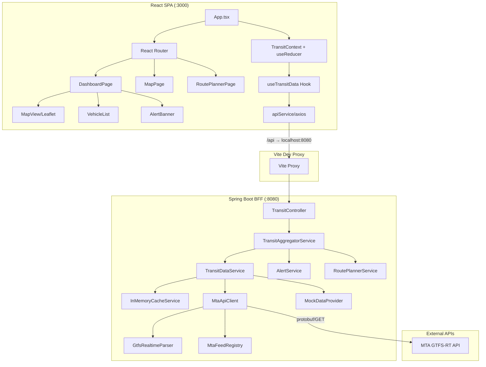
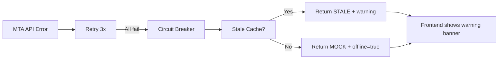

# Design Document: Public Transport Tracker

## Overview

The Public Transport Tracker is a full-stack real-time transit tracking application using a BFF (Backend for Frontend) architecture. A React 18 SPA communicates with a Spring Boot 3.2.5 gateway that fetches GTFS-Realtime protobuf data from the MTA free API, applies a graceful degradation chain (LIVE → STALE → MOCK), generates conditional alerts, and returns aggregated JSON responses. The frontend renders vehicle positions on a Leaflet map with auto-refresh polling every 30 seconds.

The system is already partially implemented. This design documents the existing architecture and identifies integration points that must work correctly for the application to function end-to-end.

## Architecture



### Key Architectural Decisions

1. **BFF Pattern**: Single Spring Boot gateway aggregates transit data, alerts, and route plans into one response per frontend request — reduces frontend complexity and network calls.
2. **React Context + useReducer**: Lightweight state management without Redux overhead. Sufficient for the query/data/loading/error/notifications state shape.
3. **In-Memory Cache (ConcurrentHashMap)**: No external cache dependency (Redis). Uses ReadWriteLock with LRU eviction, 30s fresh TTL, 300s stale TTL.
4. **Resilience4j Circuit Breaker**: Protects MTA API calls with failure-rate threshold (50%), 30s open duration, and automatic retry (3 attempts, 500ms wait).
5. **Vite Proxy**: During development, Vite proxies `/api` requests to `localhost:8080`, eliminating CORS issues in dev. In production, CORS headers are set by `WebConfig`.
6. **Data Source Mode**: Configurable via `DATA_SOURCE_MODE` env var — LIVE, CACHED, STALE, or MOCK — allowing deterministic testing of each degradation level.

## Components and Interfaces

### Backend Components

| Component | File | Responsibility |
|-----------|------|----------------|
| `TransitController` | controller/TransitController.java | REST endpoints at `/api/v1`, input validation via `@NotBlank` |
| `TransitAggregatorService` | service/TransitAggregatorService.java | Orchestrates data fetch + alert evaluation + route planning |
| `TransitDataService` | service/TransitDataService.java | Implements LIVE→STALE→MOCK fallback chain |
| `AlertService` | service/AlertService.java | Evaluates delay/disruption/crowding/weather rules |
| `RoutePlannerService` | service/RoutePlannerService.java | Computes primary + alternative routes with delay context |
| `InMemoryCacheService` | cache/InMemoryCacheService.java | LRU cache with TTL, ReadWriteLock, scheduled eviction |
| `MtaApiClient` | client/MtaApiClient.java | WebClient HTTP calls to MTA, with circuit breaker + retry |
| `GtfsRealtimeParser` | client/proto/GtfsRealtimeParser.java | Protobuf binary → VehiclePosition list (DO NOT MODIFY) |
| `MtaFeedRegistry` | client/proto/MtaFeedRegistry.java | Route → feed path mapping (DO NOT MODIFY) |
| `MockDataProvider` | client/MockDataProvider.java | Deterministic mock data for offline/testing |
| `WebConfig` | config/WebConfig.java | CORS configuration via WebMvcConfigurer |
| `AppConfig` | config/AppConfig.java | `@ConfigurationProperties` binding for app.* YAML keys |
| `WebClientConfig` | config/WebClientConfig.java | Netty HttpClient + ReactorClientHttpConnector bean |

### Frontend Components

| Component | File | Responsibility |
|-----------|------|----------------|
| `App` | App.tsx | Router setup, ErrorBoundary, lazy loading, TransitProvider |
| `TransitContext` | context/TransitContext.tsx | useReducer state: query, data, loading, error, offline, notifications |
| `useTransitData` | hooks/useTransitData.ts | Fetch logic, 30s polling, cleanup on unmount |
| `apiService` | services/apiService.ts | Axios instance, base URL `/api/v1`, interceptors |
| `DashboardPage` | pages/DashboardPage.tsx | Main view composing search + alerts + vehicles + map |
| `MapView` | components/MapView/MapView.tsx | Leaflet map with vehicle markers and popups |
| `VehicleList` | components/VehicleList/VehicleList.tsx | Sortable vehicle list with ETA/delay/crowding |
| `AlertBanner` | components/AlertBanner/AlertBanner.tsx | Conditional alert display |
| `RouteSearchPanel` | components/RouteSearchPanel/ | City + route input form |
| `OfflineModeToggle` | components/OfflineModeToggle/ | Data source indicator and offline toggle |
| `RouteAlternatives` | components/RouteAlternatives/ | Primary + alternative route display |

### API Contract

**Base URL**: `/api/v1`

| Endpoint | Method | Params | Response Type |
|----------|--------|--------|---------------|
| `/transit` | GET | `city`, `route` | `TransitResponse` |
| `/transit/{routeId}/vehicles` | GET | `city` | `List<VehiclePosition>` |
| `/transit/{routeId}/alerts` | GET | `city` | `List<Alert>` |
| `/routes/plan` | GET | `city`, `from`, `to` | `RoutePlan` |
| `/routes/{routeId}/alternatives` | GET | `city` | `RoutePlan` |

## Data Models

### Backend (Java)

```java
// TransitResponse.java
@Value @Builder
public class TransitResponse {
    String routeId;
    String city;
    DataSource dataSource;       // enum: LIVE, CACHED, STALE, MOCK
    int cacheAgeSeconds;
    boolean offline;
    String warning;              // nullable
    List<VehiclePosition> vehicles;
    List<Alert> alerts;
    RoutePlan routePlan;         // nullable
    Map<String, HateoasLink> links;
}

// VehiclePosition.java
@Value @Builder
public class VehiclePosition {
    String vehicleId;
    double lat;
    double lon;
    String nextStop;
    String eta;
    CrowdingLevel crowding;     // enum: LOW, MEDIUM, HIGH
    int delayMinutes;
    boolean disrupted;
}

// Alert.java
@Value @Builder
public class Alert {
    AlertType type;             // enum: DELAY, DISRUPTION, CROWDING, WEATHER
    Severity severity;          // enum: LOW, MEDIUM, HIGH
    String message;
    Instant generatedAt;
}

// RoutePlan.java
@Value @Builder
public class RoutePlan {
    Route primaryRoute;
    List<Route> alternatives;
    int estimatedMinutes;
}

// Route.java
@Value @Builder
public class Route {
    String routeId;
    List<Stop> stops;
    int durationMinutes;
    boolean hasDisruption;
}

// Stop.java
@Value @Builder
public class Stop {
    String stopId;
    String name;
    double lat;
    double lon;
    String eta;
}
```

### Frontend (TypeScript)

```typescript
// transit.types.ts
interface TransitResponse {
  routeId: string;
  city: string;
  dataSource: 'LIVE' | 'CACHED' | 'STALE' | 'MOCK';
  cacheAgeSeconds: number;
  offline: boolean;
  warning?: string;
  vehicles: VehiclePosition[];
  alerts: Alert[];
  routePlan?: RoutePlan;
  links: Record<string, HateoasLink>;
}

interface VehiclePosition {
  vehicleId: string;
  lat: number;
  lon: number;
  nextStop: string;
  eta: string;
  crowding: 'LOW' | 'MEDIUM' | 'HIGH';
  delayMinutes: number;
  disrupted: boolean;
}

interface Alert {
  type: 'DELAY' | 'DISRUPTION' | 'CROWDING' | 'WEATHER';
  severity: 'LOW' | 'MEDIUM' | 'HIGH';
  message: string;
  generatedAt: string;
}
```

### JSON Field Alignment

The backend `TransitResponse` Java fields use camelCase which Jackson serializes as-is. The frontend TypeScript interfaces must match exactly:

| Java field | JSON key | TypeScript field |
|-----------|----------|-----------------|
| `routeId` | `routeId` | `routeId` |
| `dataSource` | `dataSource` | `dataSource` |
| `cacheAgeSeconds` | `cacheAgeSeconds` | `cacheAgeSeconds` |
| `offline` | `offline` | `offline` |
| `warning` | `warning` (omitted if null) | `warning?` |
| `vehicles` | `vehicles` | `vehicles` |
| `alerts` | `alerts` | `alerts` |
| `routePlan` | `routePlan` (omitted if null) | `routePlan?` |
| `links` | `links` | `links` |

The `@JsonInclude(NON_NULL)` annotation on `TransitResponse` means null fields are omitted from JSON. Frontend optional fields (`warning?`, `routePlan?`) align with this behavior.


## Correctness Properties

*A property is a characteristic or behavior that should hold true across all valid executions of a system — essentially, a formal statement about what the system should do. Properties serve as the bridge between human-readable specifications and machine-verifiable correctness guarantees.*

### Property 1: Degradation chain returns correct DataSource

*For any* combination of data source mode (LIVE), cache state (fresh/stale/empty), and API result (success/failure), the `TransitDataService.fetchVehicles()` SHALL return a `FetchResult` whose `dataSource` field correctly reflects the fallback level used: CACHED when fresh cache hit, LIVE when API succeeds, STALE when API fails but stale cache exists, and MOCK when all sources are exhausted.

**Validates: Requirements 2.1, 2.2, 2.3, 2.4**

### Property 2: Cache TTL window behavior

*For any* value stored in the cache, `get()` SHALL return the value when its age is less than `ttlSeconds`, `get()` SHALL return empty and `getStale()` SHALL return the value when its age is between `ttlSeconds` and `staleTtlSeconds`, and both methods SHALL return empty when age exceeds `staleTtlSeconds`.

**Validates: Requirements 3.2, 3.3, 3.4**

### Property 3: Cache size invariant (LRU eviction)

*For any* sequence of N cache `put()` operations where N exceeds maxSize (1000), the cache `size()` SHALL never exceed maxSize.

**Validates: Requirements 3.1**

### Property 4: Alert generation correctness

*For any* list of VehiclePosition objects, the `AlertService.evaluate()` method SHALL generate a DELAY alert if and only if at least one vehicle has `delayMinutes > 15`, a DISRUPTION alert if and only if at least one vehicle has `disrupted == true`, and a CROWDING alert if and only if at least one vehicle has `crowding == HIGH`. When none of these conditions hold, the result SHALL be an empty list.

**Validates: Requirements 5.1, 5.2, 5.3, 5.5**

### Property 5: Non-subway route returns empty vehicle list

*For any* route string that is not in the MtaFeedRegistry's recognized subway route set, `MtaApiClient.fetchVehicles()` SHALL return an empty list without making any outbound HTTP request.

**Validates: Requirements 6.3**

### Property 6: Notification list capped at 20

*For any* sequence of `ADD_NOTIFICATION` dispatches to the transit reducer, the `notifications` array length SHALL never exceed 20.

**Validates: Requirements 8.4**

### Property 7: Route planner structure invariant

*For any* valid `from` string, `to` string, and list of VehiclePosition objects, `RoutePlannerService.plan()` SHALL return a `RoutePlan` with a non-null `primaryRoute` containing at least 2 stops, and `alternatives` list of size between 0 and 3 inclusive.

**Validates: Requirements 10.1, 10.2**

### Property 8: Delay increases estimated journey time

*For any* non-empty list of VehiclePosition objects where the average `delayMinutes` is greater than 0, the `RoutePlannerService.plan()` estimated journey time SHALL be strictly greater than the base time (15 minutes).

**Validates: Requirements 10.3**

## Error Handling

### Backend Error Handling

| Scenario | Behavior |
|----------|----------|
| Missing/blank request params | Spring Validation returns HTTP 400 with `detail` field |
| MTA API HTTP error (4xx/5xx) | `MtaApiClient` throws `RuntimeException` → triggers fallback chain |
| MTA API timeout (>10s) | `WebClientRequestException` → retry up to 3x → fallback chain |
| Circuit breaker OPEN | Request rejected without network call → fallback chain |
| All sources exhausted | Return mock data with `offline=true`, `dataSource=MOCK` |
| Unknown city (no provider) | `IllegalArgumentException` → HTTP 400 |

### Frontend Error Handling

| Scenario | Behavior |
|----------|----------|
| API call fails (network/timeout) | Axios interceptor normalizes error → dispatches `FETCH_ERROR` → shows error banner with retry |
| Component render error | `ErrorBoundary` catches → shows "Something went wrong" + retry button |
| STALE/MOCK data received | `OfflineModeToggle` shows data source badge + warning |
| Empty vehicle list | `VehicleList` shows empty state illustration |

### Error Propagation Flow



## Testing Strategy

### Backend Testing (JUnit 5 + Mockito)

**Unit Tests:**
- `AlertServiceTest`: Tests all alert rule combinations (delay, disruption, crowding, weather, none)
- `TransitDataServiceTest`: Tests each fallback chain mode with mocked cache and providers
- `TransitAggregatorServiceTest`: Tests orchestration with mocked dependencies
- `InMemoryCacheServiceTest`: Tests TTL behavior, LRU eviction, thread safety
- `RoutePlannerServiceTest`: Tests route planning with various vehicle delay scenarios

**Integration Tests:**
- `TransitControllerTest`: MockMvc tests for all endpoints, CORS, validation errors
- `MtaApiClientTest`: WireMock tests for HTTP interactions, timeout, error handling

**Property-Based Tests (JUnit 5 + jqwik):**

The project will use [jqwik](https://jqwik.net/) for property-based testing in Java. jqwik integrates natively with JUnit 5 and provides `@Property` annotations with configurable iteration counts.

- Property 1: Degradation chain correctness (100 iterations with randomized cache/API states)
- Property 2: Cache TTL window behavior (100 iterations with randomized ages)
- Property 3: Cache LRU size invariant (100 iterations with random key/value sequences)
- Property 4: Alert generation correctness (100 iterations with randomized vehicle lists)
- Property 7: Route planner structure invariant (100 iterations)
- Property 8: Delay increases journey time (100 iterations)

**Tag format:** `Feature: public-transport-tracker, Property N: <property text>`

### Frontend Testing (Vitest + Testing Library)

**Unit Tests:**
- `TransitContext.test.tsx`: Tests all reducer actions and state transitions
- `VehicleList.test.tsx`: Tests rendering, sorting, empty state
- `AlertBanner.test.tsx`: Tests conditional rendering of alerts
- `formatters.test.ts`: Tests utility formatting functions

**Property-Based Tests (Vitest + fast-check):**

The frontend will use [fast-check](https://github.com/dubzzz/fast-check) for property-based testing.

- Property 6: Notification cap (100 iterations dispatching random alert sequences)

**Integration Tests:**
- API service tests with mocked axios
- Component integration tests verifying data flow from context to UI

### Test Configuration

- **jqwik** minimum iterations: 100 per property
- **fast-check** minimum runs: 100 per property (`fc.assert(property, { numRuns: 100 })`)
- Backend tests: `mvn test` (surefire includes `*Test.java`)
- Frontend tests: `npm run test` (vitest run mode)
- CI: Both test suites run in parallel in Jenkins pipeline

### Dependency Additions for PBT

**Backend (pom.xml):**
```xml
<dependency>
    <groupId>net.jqwik</groupId>
    <artifactId>jqwik</artifactId>
    <version>1.8.4</version>
    <scope>test</scope>
</dependency>
```

**Frontend (package.json devDependencies):**
```json
"fast-check": "^3.19.0"
```
