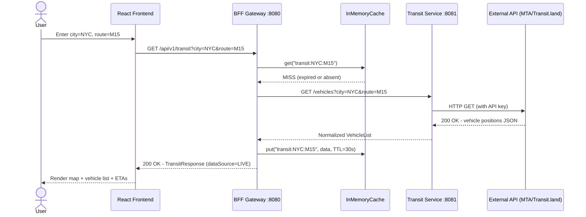
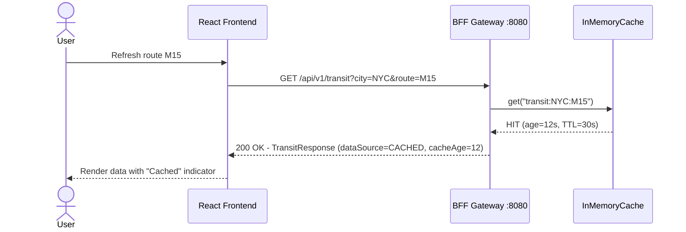
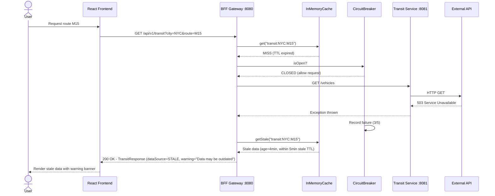
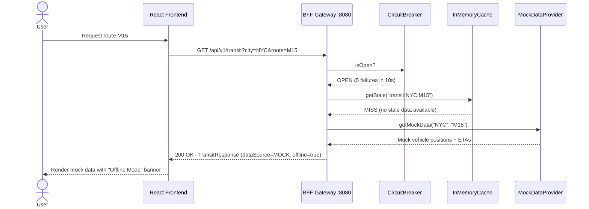
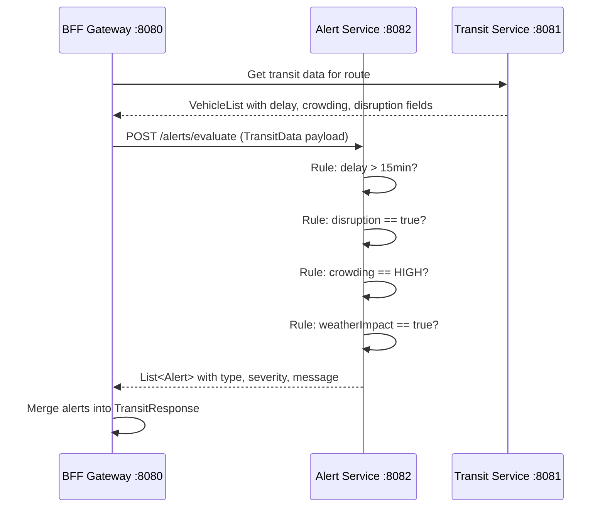
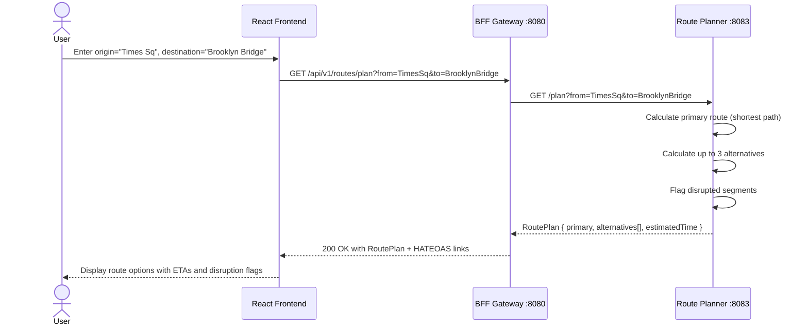
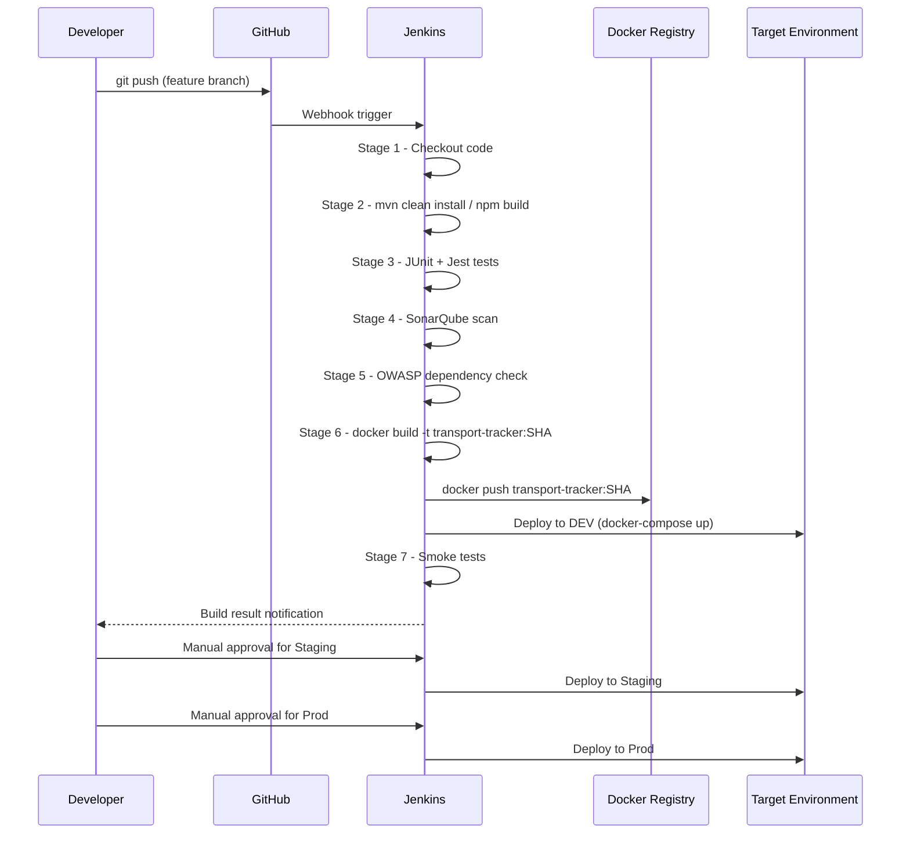
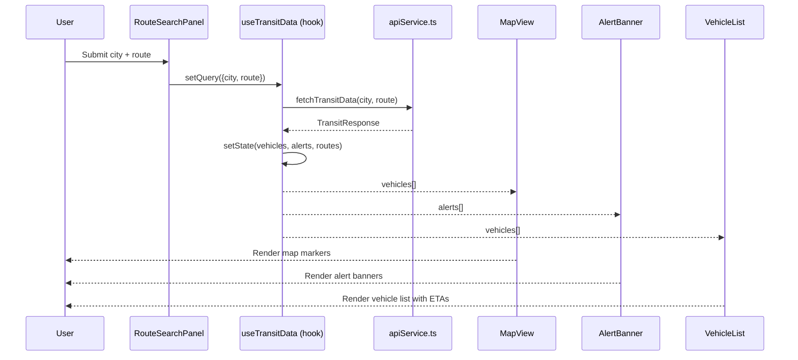

# Public Transport Tracker — Sequence Diagrams

All diagrams are in **Mermaid** format. Paste them at https://mermaid.live to render.

---

## 1. Real-Time Transit Data Fetch (Happy Path)

---

## 2. Cache Hit Flow

---

## 3. API Failure — Stale Cache Fallback

---

## 4. Full Offline / Mock Fallback (Circuit Open)

---

## 5. Alert Evaluation Flow

---

## 6. Route Planning Flow

---

## 7. CI/CD Pipeline Sequence

---

## 8. Frontend Component Interaction (React)

