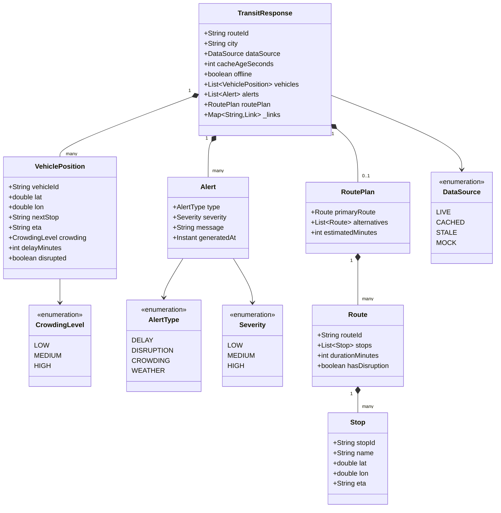
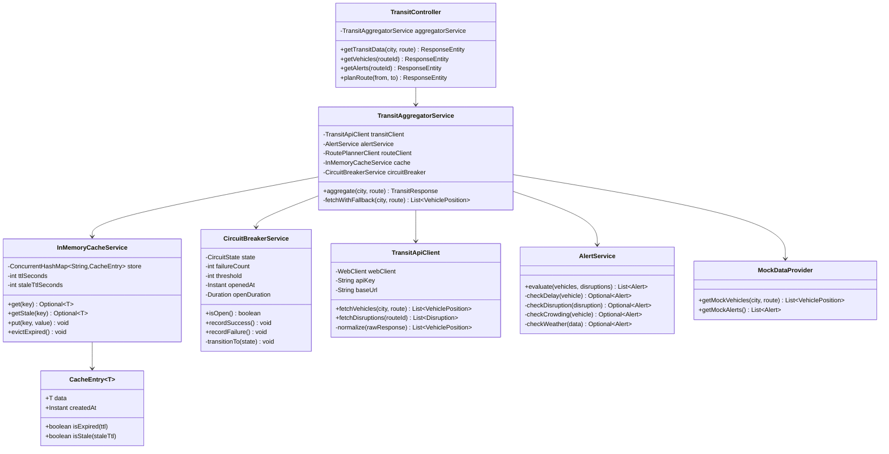
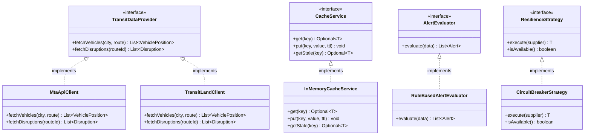
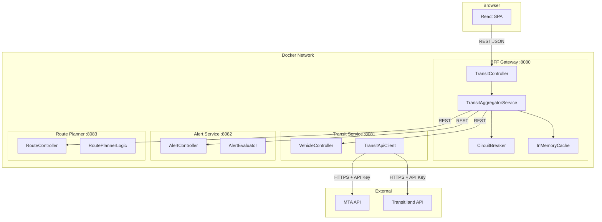
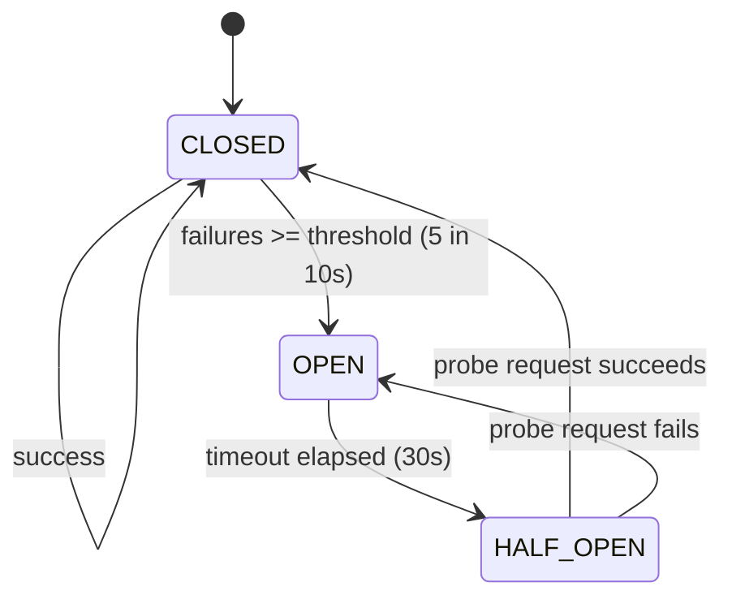
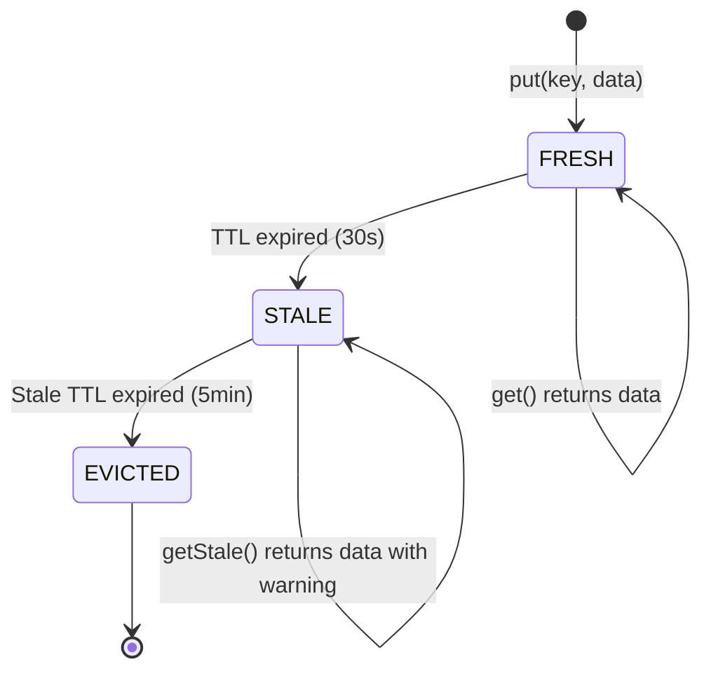
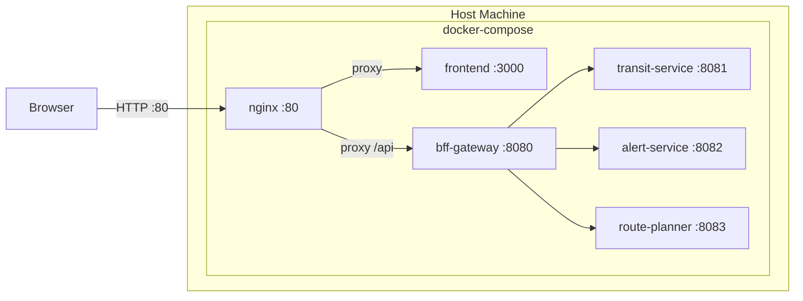
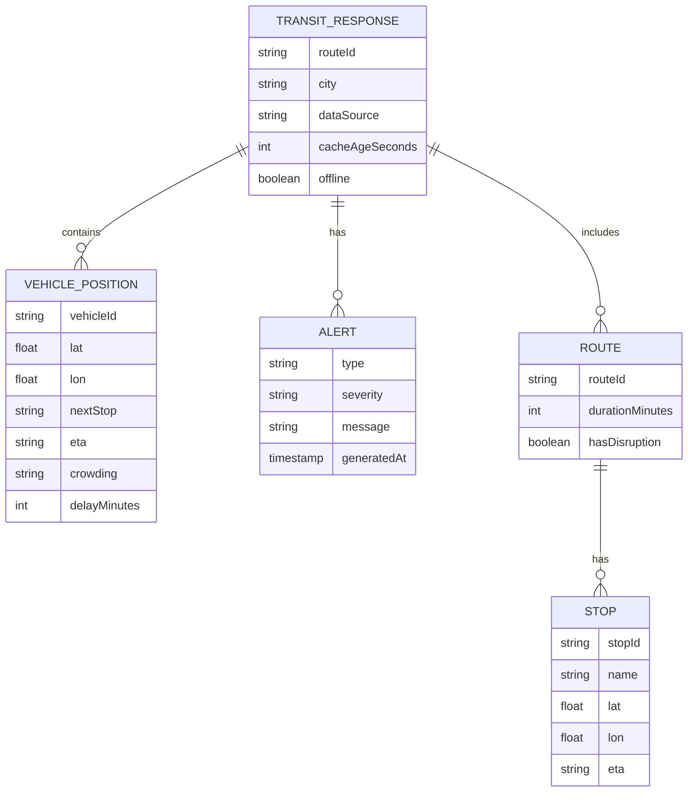
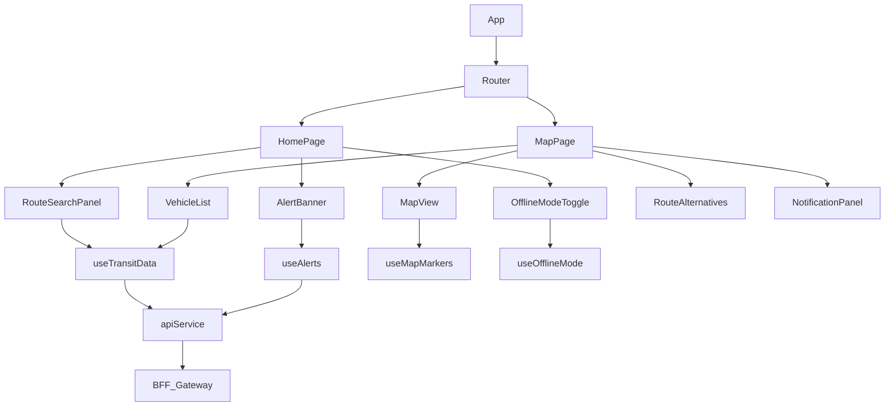

# Public Transport Tracker — UML & LLD Diagrams

All diagrams use **Mermaid** syntax. Render at https://mermaid.live

---

## 1. Class Diagram — Domain Models



---

## 2. Class Diagram — BFF Gateway Service Layer



---

## 3. Class Diagram — Interfaces & SOLID Design



> This design follows **Dependency Inversion Principle** — high-level modules depend on abstractions, not concretions.

---

## 4. Component Diagram — Full System



---

## 5. State Diagram — Circuit Breaker



---

## 6. State Diagram — Cache Entry Lifecycle



---

## 7. Deployment Diagram



---

## 8. Entity Relationship — Data Models (Logical, No DB)



---

## 9. React Component Tree (UI Architecture)



---

## 10. Package Structure — Backend (LLD)

```
transport-tracker-bff/
├── src/main/java/com/tracker/
│   ├── controller/
│   │   ├── TransitController.java
│   │   └── HealthController.java
│   ├── service/
│   │   ├── TransitAggregatorService.java
│   │   ├── AlertService.java
│   │   └── MockDataProvider.java
│   ├── client/
│   │   ├── TransitDataProvider.java       ← interface
│   │   ├── MtaApiClient.java
│   │   └── TransitLandClient.java
│   ├── cache/
│   │   ├── CacheService.java              ← interface
│   │   ├── InMemoryCacheService.java
│   │   └── CacheEntry.java
│   ├── resilience/
│   │   ├── ResilienceStrategy.java        ← interface
│   │   └── CircuitBreakerService.java
│   ├── model/
│   │   ├── TransitResponse.java
│   │   ├── VehiclePosition.java
│   │   ├── Alert.java
│   │   ├── RoutePlan.java
│   │   ├── Route.java
│   │   └── Stop.java
│   ├── config/
│   │   ├── AppConfig.java
│   │   ├── SecurityConfig.java
│   │   └── WebClientConfig.java
│   └── TransportTrackerApplication.java
├── src/main/resources/
│   ├── application.yml
│   ├── application-dev.yml
│   ├── application-staging.yml
│   └── application-prod.yml
├── src/test/java/com/tracker/
│   ├── controller/TransitControllerTest.java
│   ├── service/TransitAggregatorServiceTest.java
│   ├── cache/InMemoryCacheServiceTest.java
│   └── bdd/steps/TransitSteps.java
├── Dockerfile
├── Jenkinsfile
└── pom.xml

transport-tracker-frontend/
├── src/
│   ├── components/
│   │   ├── RouteSearchPanel/
│   │   ├── MapView/
│   │   ├── VehicleList/
│   │   ├── AlertBanner/
│   │   ├── OfflineModeToggle/
│   │   └── RouteAlternatives/
│   ├── hooks/
│   │   ├── useTransitData.ts
│   │   ├── useAlerts.ts
│   │   └── useOfflineMode.ts
│   ├── services/
│   │   └── apiService.ts
│   ├── types/
│   │   └── transit.types.ts
│   └── App.tsx
├── Dockerfile
└── package.json
```
